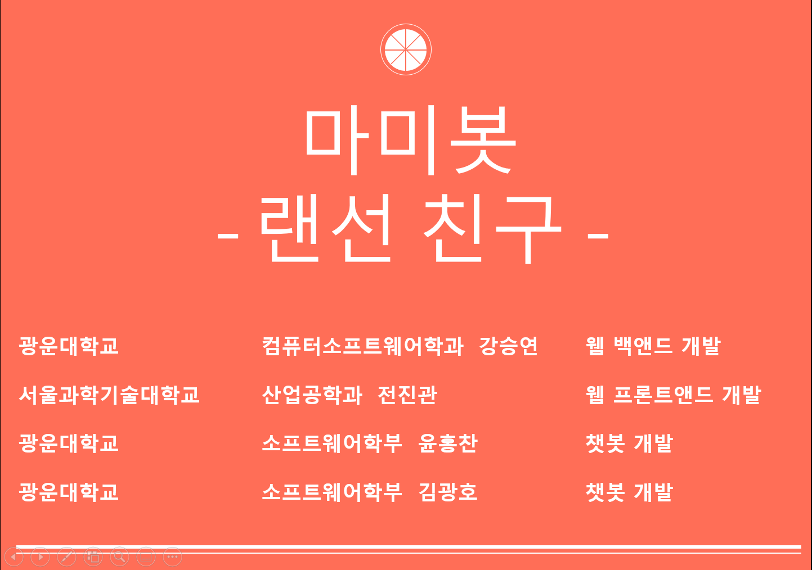
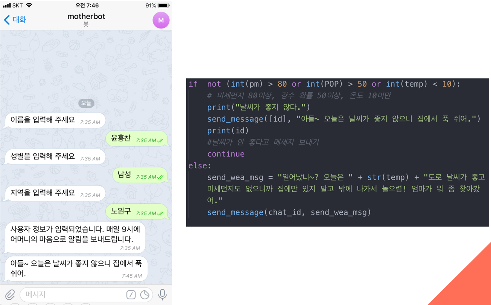
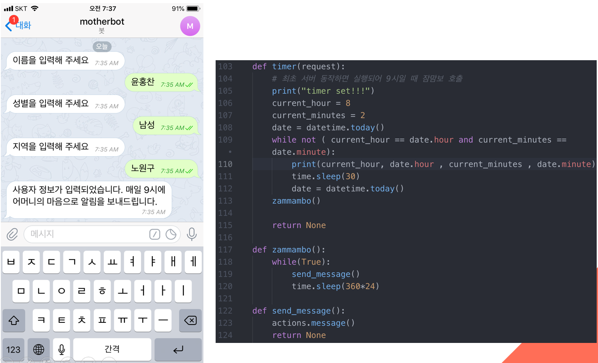
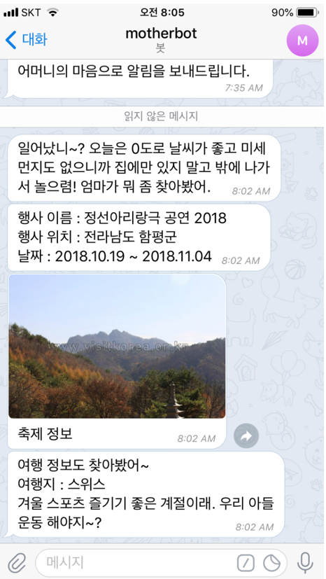

광운대학교에서 주최한 KW - Hackathon에서 장려상을 수상한 프로젝트입니다. 
Jsp를 이용해 웹사이트틀 만들고, Django를 활용해 챗봇을 만들었습니다.

 사용자의 정보를 입력받고 그 지역의 미세먼지, 강수 확률, 온도를 이용해 보내줄 메세지를 결정합니다.

 특정 시간에 알림을 보내는 방법입니다. 루프를 안에서 특정 시간만큼 sleep 후 시간이 되면 메세지를 보냅니다.

 시연 이미지 (발표가 8시에 있어서 보내는 시간을 8시로 수정했습니다.)
