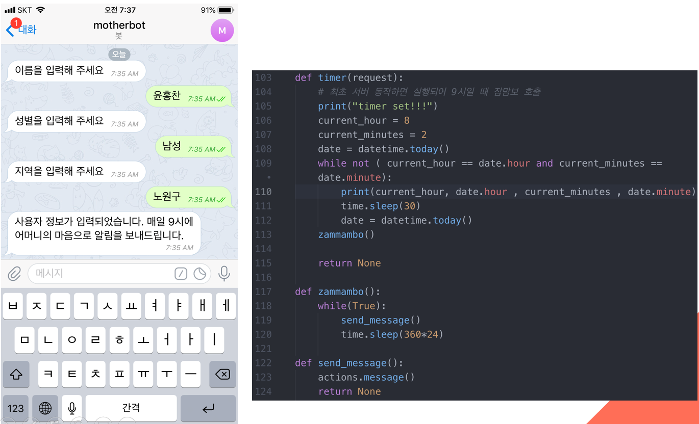
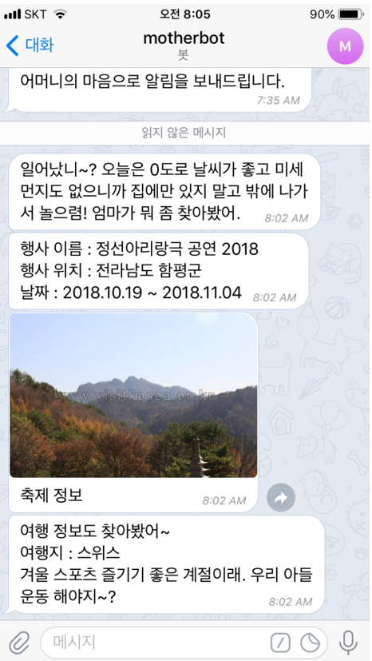

## 마미봇 (축제, 공연 정보 알리미 Chat Bot)

&nbsp;&nbsp;&nbsp;&nbsp;&nbsp;&nbsp;&nbsp;&nbsp;&nbsp;&nbsp;&nbsp;&nbsp;&nbsp;&nbsp;&nbsp;&nbsp;&nbsp;&nbsp;&nbsp;&nbsp;&nbsp;&nbsp;&nbsp;&nbsp;&nbsp;&nbsp;&nbsp;&nbsp;&nbsp;&nbsp;&nbsp;&nbsp;&nbsp;&nbsp;&nbsp;&nbsp;&nbsp;&nbsp;&nbsp;&nbsp;&nbsp;&nbsp;&nbsp;&nbsp;&nbsp;&nbsp;&nbsp;&nbsp;&nbsp;&nbsp;&nbsp;&nbsp;&nbsp;&nbsp;&nbsp;&nbsp;&nbsp;&nbsp;&nbsp;&nbsp;*2019-1 응용소프트웨어실습 팀 프로젝트*

**"겨울방학을 즐겁게 보내기 위한 SW 개발"**

**겨울방학을 알차게 보낼 수 있도록 축제나 공연, 여행과 같은 정보들을 매일 정해진 시간 알림 서비스 형태로 제공하는 웹과 메신저 기반 Chat Bot을 개발**

 

- **구현한 기능 소개**
  - 사용자의 정보를 저장
  - 매일 정해진 시간에 날씨 정보를 확인
  - 날씨가 좋으면 (미세먼지, 온도, 강수량 고려) 축제 정보를 전송 - 축제 정보는 크롤링하여 얻음
  - 날씨가 좋지 않으면 집에서 쉬라는 메시지 전송

 

- **사용한 언어 및 도구, 라이브러리**
  + Python3
  + Django
  + Java
  + JSP
  + MySQL
  + Open API (날씨)
  + Google Dialogflow
  + goorm IDE

 

+ **개발 환경**
  + macOS Mojave / Windows 10
  + Visual Studio Code

 

- **프로젝트 구성원 및 개발 기간**
  + 광운대학교 소프트웨어학부 윤홍찬, 김광호
  + 광운대학교 컴퓨터소프트웨어학과 강승연
  + 서울과학기술대학교 산업공학과 전진관
  + 2018.10.26 ~ 10.27

 

- **스크린샷**

  </img>
  
   
  
  </img>

---

> 2019.11.6 최종 업데이트
>
> 광운대학교 소프트웨어학부 윤홍찬

